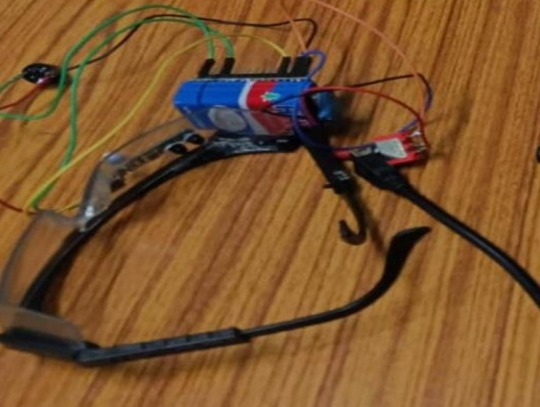
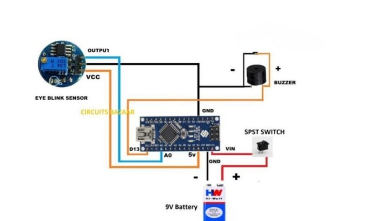

# Sleep-Precaution-Glasses-for-a-Safe-Driving
We present the plans of a sleep-precaution-glasses, which will be capable of avoiding road accidents by detecting driver drowsiness by using IoT.
 
<h2>Abstract :</h2>
 
More than 30% accidents occur due to drowsiness. It is one of the critical causes of roadways accidents now-a-days. For the prevention of this, a system is required which detects the drowsiness and alerts the driver which saves the life. In this project, we present a scheme for driver drowsiness detection. In this project, we propose sleep precaution glasses for a safe driving that utilizes a IR sensor integrated with an Arduino IoT platform. An IR sensor interprets eyeblink pattern and as we set it measures the distance of eyelid ,if distance is less that its specific value it assumes that the driver is in drowsiness state and then it counts the time if the timing is exceed the 2 seconds then it will alarm which will alert the driver so that he can take an action.By leveraging the capabilities of Arduino and IoT technology, real-time monitoring and remote data processing are achieved, enabling efficient and timely analysis of driver drowsiness.

The project involves, the hardware setup of an Arduino board , IR sensor module, and appropriate 
wiring connections. An Arduino IDE is utilized to develop the code, which involves reading the 
analog output from the IR sensor and then mapping it to a buzzer an appropriate output.Through an IoT platform , the data is analyzed and monitored remotely. This system provides a cost effective and accessible solution for driver drowsiness ,suitable for application in various such as for paralyzed patient etc.

The outcomes of this project contribute to the drowsiness monitoring by showcasing a practical 
implementation of a IR-based detection system using Arduino IoT technology. The integration of 
IoT capabilities enables real-time monitoring, data processing, and remote access, enhancing the 
efficiency and effectiveness of sleep precaution glasses for a safe driving and decision-making 
processes.
 
 
It is developed through Arduino open-source IDE : Internet of Things
 

 
 
The diagram shows the working of device.
 

 
 
 
Note : Just download code and run on Arduino Platform (you can install arduino platform in your pc/laptop by searching arduino download).
